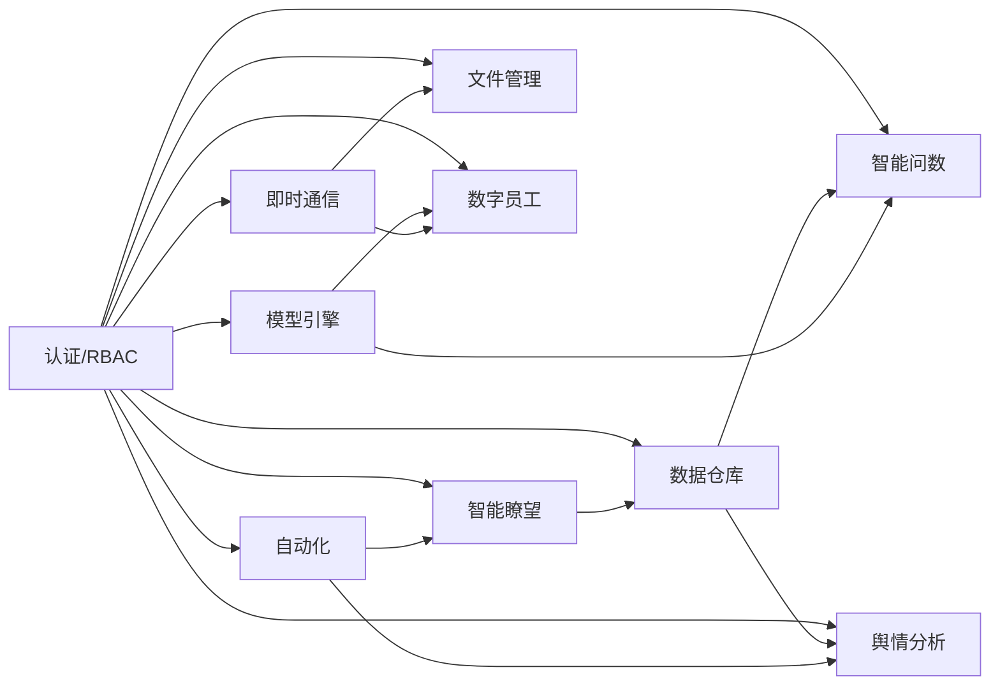

# 模块边界

## 认证、RBAC 与功能导航

**负责**

- 用户身份、会话、角色、权限、功能导航配置和后台访问控制。
- 为其他模块提供当前用户与权限判定能力。

**不负责**

- 定义采集、问数或模型业务规则。
- 仅依靠前端菜单隐藏实现授权。

**功能导航规则**

- 菜单配置负责页面导航展示与权限映射，不代表相应业务接口自动存在。
- 内置功能可以调整展示信息、排序和启用状态，但不得绕过其既定权限要求。

## 模型引擎

**负责**

- 管理 OpenAI 兼容模型连接配置与启停状态。
- 提供默认模型选择、测试调用和正式调用记录。
- 对上层业务暴露统一模型调用能力。

**不负责**

- 决定采集内容是否可用。
- 自行生成问数检索依据或绕过用户权限。

## 智能瞭望

**负责**

- 数据源、采集规则与任务生命周期。
- 安全校验通过后的外部内容采集和解析。
- 将标准化结果交付数据仓库。

**不负责**

- 存储可供问数使用的最终治理结论。
- 允许任意脚本、任意内网请求或未受控凭据透传。

## 数据仓库

**负责**

- 标准化内容的存储、去重、来源追踪、筛选和状态治理。
- 向问数模块提供可用内容检索。

**不负责**

- 调用外部来源执行采集。
- 直接调用模型生成答案。

## 智能问数

**负责**

- 管理用户问数会话与问题。
- 检索可用数据依据，调用模型引擎生成流式回答。
- 保存回答与引用数据之间的关系。

**不负责**

- 将未审核可用或已排除的数据擅自作为依据。
- 管理模型密钥或采集规则。

## 审计能力

审计是横向能力，由各模块在高风险动作完成时写入统一审计记录；审计记录不可成为业务状态的唯一来源。

## 即时通信（Phase 6）

**负责**

- 好友关系、联系人、私聊与群聊会话生命周期。
- 消息持久化、未读计数、历史记录补拉和实时推送（WebSocket）。
- 已读回执、输入状态和在线状态。

**不负责**

- 管理模型配置或调度定时任务。
- 在非 `@提及` 场景主动调用数字员工。

## 数字员工与工具（Phase 7）

**负责**

- 数字员工配置（提示词、绑定模型、触发方式）。
- 工具注册表与工具调用日志。
- 群聊 `@提及` 触发、私聊主动回复、多轮上下文管理。

**不负责**

- 定义用户在聊天中的权限边界。
- 自动执行未绑定到员工配置的任意工具。

## 舆情分析（Phase 8）

**负责**

- 知识库和授权聊天内容的聚合统计与分析任务。
- AI 情感倾向、风险识别、热点挖掘和报告摘要生成。
- 词云、统计口径和可视化数据供给。

**不负责**

- 直接跨用户访问聊天内容（需依赖聊天模块的授权边界）。
- 生成无法追溯到统计批次的结论。

## 自动化与调度（Phase 9）

**负责**

- 定时采集任务、分析和报告生成工作流的配置与执行。
- 计划持久化、执行记录、失败重试和审计。

**不负责**

- 定义采集数据的具体内容（复用智能瞭望模块）。
- 直接调用模型或管理模型凭据。

## 文件管理（Phase 6+）

**负责**

- 文件上传、下载、SHA-256 去重、权限校验和存储统计。
- 后台文件列表、删除和存储治理。

**不负责**

- 定义即时通信会话中的文件收发逻辑（消息中引用 `file_id` 即可）。

## 依赖方向

