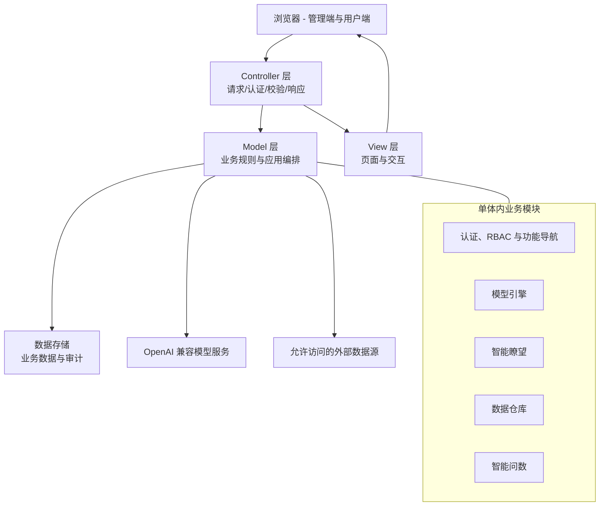
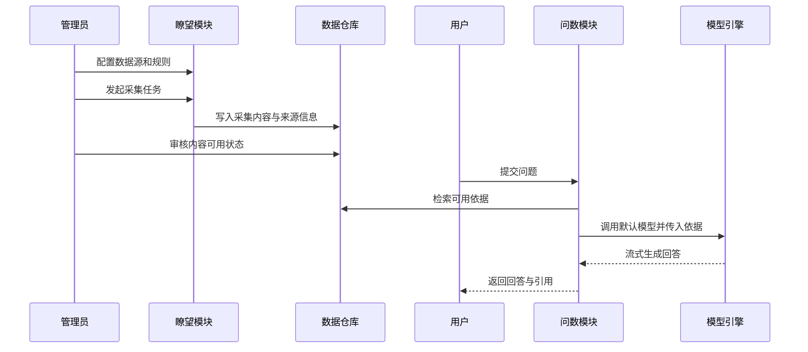

# 目标系统架构

## 架构选择

首版采用 Python 模块化 MVC 单体应用。所有正式业务模块在一个可部署应用内协作，共享统一认证、权限、安全审计和持久化边界。

此选择面向当前目标：尽快跑通采集到问数的闭环，保持调试、部署和 AI 辅助开发的可控性。首版不承担微服务引入的网关、跨服务鉴权、分布式事务和多服务运维成本。

## 系统视图

## 主业务流

## MVC 约束

- Controller 不直接拼接数据库操作或采集/AI 业务流程。
- Model 包含领域规则和持久化编排；实现时可在 `models` 范围内拆分实体、仓储和业务服务。
- View 只承载展示和用户交互，所有权限和数据范围由服务端最终判定。
- 模块通过明确的业务能力协作，不通过复制数据规则或绕过安全控制耦合。

## 微服务评估触发条件

只有出现独立扩缩容、采集执行影响主站稳定性、独立团队交付边界或强隔离合规要求时，才为相关模块设计服务拆分方案。
