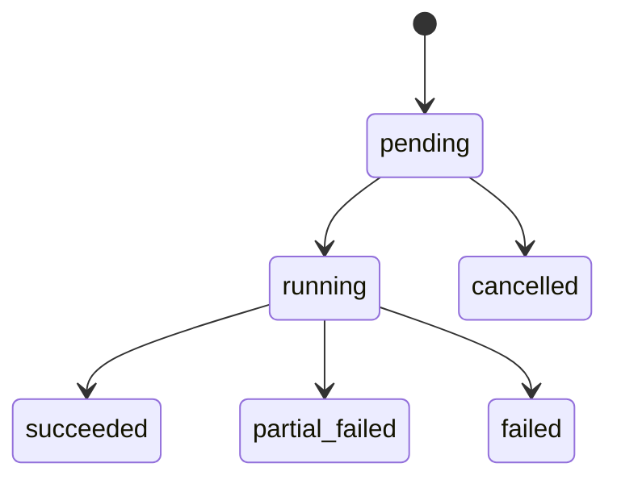

# 数据规则与生命周期

## 1. 权限规则

首版系统权限代码由应用初始化并随版本维护：

| 权限代码 | 控制能力 |
| --- | --- |
| `users.manage` | 管理用户与账户状态 |
| `roles.manage` | 管理角色与角色权限映射 |
| `functions.manage` | 管理后台功能导航配置 |
| `models.view` | 查看模型配置与统计 |
| `models.manage` | 新增、编辑、启停和设定默认模型 |
| `models.test` | 发起模型测试调用 |
| `watch.sources.manage` | 管理数据源与规则 |
| `watch.tasks.run` | 发起采集任务 |
| `watch.tasks.view` | 查看任务与执行结果 |
| `data.items.view` | 查看数据仓库内容 |
| `data.items.manage` | 调整内容可用状态 |
| `qa.use` | 使用智能问数 |
| `audit.view` | 查看审计记录 |

- 用户拥有其任一启用角色授予的权限并集。
- 停用用户不得建立新会话或使用任何受保护接口。
- 登录创建服务端会话；退出、密码重置或用户停用时撤销相关有效会话。
- 停用角色不再贡献权限，但保留历史关联便于审计。
- 系统管理员和系统角色的保护操作必须在事务内校验，避免系统失去管理入口。

## 2. 功能导航规则

- `functions` 管理后台展示结构和页面入口；`permissions` 管理服务端授权，两者不可互相替代。
- 返回当前用户导航树时，只包含 `status=active` 且用户具备 `required_permission_code` 的节点；无权限子项时可省略空父节点。
- 内置关键功能只允许修改展示信息、排序和可见状态范围内的安全字段，不允许删除或将权限要求置空以绕过授权。
- 新增导航项指向尚未实现的页面时，必须明确标识为未上线，不得出现在正式可用菜单中。
- 导航层级、状态和权限关联变化需要写审计记录。

## 3. 模型配置生命周期

- 新建模型默认为 `disabled` 或需显式启用，避免未经验证即进入问数链路。
- 设置默认模型前，必须确认模型为 `active` 且通过最近一次连接测试，或由管理员显式确认风险。
- 设置新默认模型须以原子操作取消旧默认模型，始终至多存在一个启用默认模型。
- 停用默认模型前必须指定替代默认模型，或明确使问数功能暂不可用。
- 更新凭据只覆盖加密密文与展示掩码，调用日志不得保存凭据内容。
- 模型调用记录在请求开始时创建；无论成功失败，都在结束时写入状态与脱敏结果。

## 4. 数据源与规则生命周期

- 数据源保存前校验入口 URL 与 `allowed_hosts`；敏感认证配置独立加密。
- 启用数据源至少需要一条启用且结构校验成功的规则。
- 禁用数据源后不得创建新采集任务；历史任务与内容继续保留。
- 修改规则不影响历史任务：`collection_task_sources` 保存执行时选择的规则关联和结果。
- 规则仅可表达受支持的请求参数与解析映射，禁止脚本执行和不受控地址拼接。

## 5. 采集任务生命周期

- 创建任务时锁定参与的数据源和规则；无有效启用来源则拒绝创建。
- 任务运行前再次执行 SSRF 和来源状态校验。
- 单来源失败不应删除其他来源成功内容；混合结果为 `partial_failed`。
- 失败摘要只记录诊断信息，不写入密钥、认证头或完整响应敏感内容。

## 6. 内容入库与治理

- 解析结果标准化后计算 `content_hash`；根据来源外部键或哈希执行去重。
- 对已存在内容再次采集时，更新可变元信息和最近采集时间，不产生重复可用条目。
- 无论新建、更新还是命中重复内容，都通过 `collection_task_items` 记录该任务与内容的关联和处理结果。
- 新入库内容默认可配置为 `available` 或需审核后 `available`；具体默认策略在实现前记录为决策。
- `excluded` 内容因质量或合规原因不可用于问数；`archived` 内容不参与正常检索，但保留追溯。
- 内容治理状态变化必须写入审计日志。

## 7. 问数与引用

- 用户只可读取自己的问数会话，具有管理权限的专用后台能力另行设计后方可开放。
- 问数检索仅选择 `knowledge_items.status=available` 的内容。
- 生成回答前保存用户问题；流式开始时建立 `streaming` 回答记录，成功完成后写为 `completed`，中断或异常写为 `failed`。
- `qa_citations` 保存实际提供给模型并展示给用户的依据摘录；后续内容修改不应改写历史回答所用摘录。
- 问数失败仍保留问题、失败回答状态和脱敏模型调用记录，以支持诊断。

## 8. 敏感数据与审计

- `password_hash`、`credential_ciphertext`、`auth_ciphertext` 为敏感字段，不出现在列表、详情响应、日志或审计详情中。
- 凭据更新、权限变更、采集规则变更、任务运行和内容状态变化必须产生审计记录。
- 审计记录原则上只追加，不由普通业务删除；保留周期由部署与合规策略确定。
