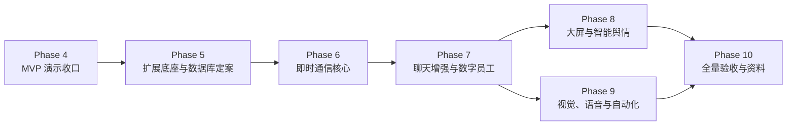

# 团队任务书后续开发计划

## 1. 计划目标

本文将《团队任务书 - 基于 AI 的智能瞭望与智能问数系统的开发》拆分为可执行、可并行、可验收的后续阶段。

现有 `docs/product/mvp.md` 和 `docs/planning/development-plan.md` 继续作为智能瞭望与智能问数首版闭环的正式契约。本文承接 Phase 4 之后的课程任务扩展交付，不覆盖已经完成的首版设计，也不把尚未设计的扩展功能误标为已经实现。

任务书总分为 100 分：

| 任务 | 交付范围 | 分值 | 当前判断 |
| --- | --- | --- | --- |
| 团队任务 1 | 智能瞭望与智能问数系统，覆盖用户侧和管理侧 | 20 | 主体已实现，仍需 Phase 4 演示与产品化收口 |
| 团队任务 2 | 仿微信智能即时通信、数字员工和管理后台 | 30 | 待设计与实现 |
| 团队任务 3 | 数智大屏与智能舆情 | 20 | 待设计与实现 |
| 团队任务 4 | 手势、语音和自动化增强 | 20 | 待设计与实现 |
| 团队任务 5 | 默认 SQLite、支持 MySQL 和后台切换 | 10 | 待技术定案与实现 |

## 2. 执行原则

- 先完成 Phase 4 MVP 验收，保留一条随时可演示的稳定基线。
- 即时通讯是后续业务主干；数字员工、舆情和交互增强都依赖聊天数据或聊天界面。
- 多数据库支持会影响后续新增表、迁移和测试，应在大量聊天表落地前完成兼容方案定案。
- 每个阶段开始前先补充对应 `docs/database/`、`docs/api/` 和必要的架构契约，再编写实现。
- 扩展功能继续遵守服务端权限、CSRF、敏感配置保护、审计和数据范围校验，不因课程演示降低安全边界。
- 前后端继续采用单仓分离开发：后端只提供 API、健康检查和 OpenAPI 文档，前端只通过正式 API 和实时通信协议访问后端。
- 一个工作包只由一名负责人主导；共享迁移、权限字典、系统导航和公共类型变更需要提前同步。

## 3. 三人并行责任流

延续现有三条工作流，并为扩展范围补充责任：

| 工作流 | 主要责任 | 后续重点 |
| --- | --- | --- |
| A：平台与安全 | 认证、权限、安全、迁移、基础设施和后台治理 | 注册安全、多数据库兼容、实时通信鉴权、文件安全、服务器配置、自动化调度 |
| B：业务与 AI | 聊天领域、数字员工、工具调用、舆情分析和数据编排 | 好友/群聊/消息、数字员工、多轮上下文、天气工具、舆情分析、任务链 |
| C：界面与验收 | 用户端、管理端、可视化、交互增强和演示材料 | 主入口、仿微信聊天界面、后台页面、大屏、天气特效、语音、手势、PPT/视频 |

建议每个阶段使用独立工作分支：

| 阶段 | 建议分支 |
| --- | --- |
| Phase 4 | `fix/phase-4-mvp-acceptance` |
| Phase 5 | `feat/phase-5-extension-foundation` |
| Phase 6 | `feat/phase-6-chat-core` |
| Phase 7 | `feat/phase-7-chat-ai-admin` |
| Phase 8 | `feat/phase-8-sentiment-dashboard` |
| Phase 9 | `feat/phase-9-interaction-automation` |
| Phase 10 | `chore/phase-10-demo-delivery` |

## 4. Phase 4：现有 MVP 演示收口

**目标**：先稳定拿下团队任务 1 的核心交付，形成可持续回归的基线。

| 工作流 | 工作包 | 核心验收 |
| --- | --- | --- |
| A | 复核权限矩阵、安全边界、审计完整性、发布配置和登录防暴力策略 | 无权请求被拒绝；敏感信息不泄露；高风险动作有脱敏审计 |
| B | 复核迁移初始化、采集失败策略、问数外部依赖失败与 SSE 中断收敛 | 从空库迁移后可运行；失败状态可诊断；不残留运行态 |
| C | 执行 `docs/product/mvp.md` 四条用户旅程，修复页面集成、交互和风格问题 | 管理员完成配置、采集、治理；普通用户完成问数并查看引用和历史 |

**完成门槛**：

- 登录、RBAC、模型、采集、治理、问数和引用链路可现场连续演示。
- 后端全量测试、前端构建和前端单元测试通过。
- 固化一份任务 1 演示脚本和一段可作为兜底的演示视频。

## 5. Phase 5：课程扩展底座与多数据库定案

**目标**：在新增大量聊天实体之前，冻结扩展架构并处理数据库兼容方向。

### 5.1 必须先确认的技术选择

| 事项 | 当前基线 | 任务书要求 | 本阶段输出 |
| --- | --- | --- | --- |
| 数据库 | PostgreSQL + asyncpg + Alembic | 默认 SQLite，可切换 MySQL | 明确 PostgreSQL 是否保留为可选开发数据库；确定 SQLite/MySQL 驱动、迁移和连接切换方案 |
| 实时通信 | 尚未建设 | 私聊、群聊和数字员工群内回复 | 在 WebSocket 与其他方案中定案；明确鉴权、断线重连、消息补拉和未读数边界 |
| 文件存储 | 尚未建设 | 聊天文件收发和后台集中管理 | 确定本地演示存储、SHA-256 去重、权限校验、大小限制和下载方式 |
| 用户注册 | MVP 不开放注册 | 用户侧允许注册 | 定义注册接口、用户名规则、密码规则、防滥用策略和默认普通用户角色 |
| 自动化 | 仅支持手动采集 | 定时采集或自动工作流 | 确定调度器、任务持久化、重复执行和失败记录策略 |
| 视觉手势 | 尚未建设 | 至少 5 种手势交互效果 | 默认按摄像头视觉识别设计；明确浏览器能力、识别方案、误触防护和无设备降级路径 |

### 5.2 并行工作包

| 工作流 | 工作包 | 核心验收 |
| --- | --- | --- |
| A | 数据库兼容性验证；注册安全设计；聊天权限代码；实时通信鉴权；文件安全规则 | SQLite 和 MySQL 均能执行最小迁移、初始化、登录和基础 CRUD 冒烟测试 |
| B | 聊天、数字员工、工具、舆情和自动化领域模型草案；冻结实体边界 | `docs/database/` 和模块边界覆盖后续实体与关系 |
| C | 用户侧主入口信息架构；智能问数/智能聊天入口；聊天和大屏交互原型 | 路由、导航和页面骨架评审通过 |

**完成门槛**：

- 新增扩展模块正式契约，不直接复用早期原型路由或表结构。
- SQLite/MySQL 兼容策略经过最小代码验证，不只停留在文档设想。
- 后续 Phase 6-9 所需权限代码、系统导航和迁移顺序冻结。

## 6. Phase 6：用户入口与即时通信核心

**目标**：完成可演示的仿微信聊天主链路。

### 6.1 功能范围

| 模块 | 必须交付 |
| --- | --- |
| 用户入口 | 用户注册、登录后主界面、智能问数/智能聊天入口选择 |
| 通讯录 | 用户名查找、好友申请、接受或拒绝、好友列表 |
| 私聊 | 会话列表、1v1 文本消息、聊天历史、未读数、断线后补拉 |
| 群聊 | 拉好友建群、群成员列表、群内文本消息、退出群聊 |
| 实时通信 | 登录态鉴权、消息持久化、消息推送、重连策略 |

### 6.2 并行工作包

| 工作流 | 工作包 | 核心验收 |
| --- | --- | --- |
| A | 注册 API、安全限制、聊天权限、WebSocket 鉴权、会话隔离和消息数据范围 | 未登录用户不可连接；非好友不可私聊；非群成员不可读取或发送群消息 |
| B | 好友申请、联系人、私聊会话、群组、群成员、消息持久化、未读和历史补拉 | 两名用户可加好友并私聊；三名用户可建群并群聊；刷新后历史仍存在 |
| C | 主入口、注册页、通讯录、会话列表、私聊页、群聊页和基础移动端布局 | 用户可从注册进入主界面并完成私聊和群聊完整流程 |

**完成门槛**：

- 任务书中的注册、主入口、1v1 私聊、群聊、通讯录、在线查找和拉好友建群可演示。
- 消息先持久化再确认发送成功；断线或刷新后可恢复聊天记录。
- 服务端具备权限、CSRF 或实时协议等价防护、输入校验和必要审计。

## 7. Phase 7：聊天增强、数字员工与后台治理

**目标**：完成团队任务 2 的剩余能力，形成智能聊天子系统完整演示。

### 7.1 用户侧能力

| 模块 | 必须交付 |
| --- | --- |
| 消息增强 | emoji、动态表情、文件上传下载 |
| 数字员工 | 川农小助手、天气小助手、毒鸡汤助手、通用 AI 助手 |
| 多轮对话 | 数字员工私聊上下文；群聊中通过 `@数字员工` 触发回复 |
| 天气体验 | 输入城市后展示天气卡片，并联动背景或风格特效 |
| 服务器切换 | 多聊天服务器配置可用；程序具备健康检查与自动选择或故障切换行为 |

### 7.2 管理侧能力

| 模块 | 必须交付 |
| --- | --- |
| 群管理 | 群列表、群详情、成员查看、解散、管控、封禁、系统群公告 |
| 文件管理 | 文件列表、下载权限、删除、存储统计、SHA-256 去重 |
| 服务器管理 | 服务器列表、配置、启停、健康检查、主节点或优先级、切换记录 |
| 数字员工管理 | 员工创建、编辑、启停、提示词配置、工具集可视化绑定 |
| 工具管理 | 工具注册、配置、启停、调用边界和数字员工绑定 |

### 7.3 并行工作包

| 工作流 | 工作包 | 核心验收 |
| --- | --- | --- |
| A | 文件安全与去重；群治理权限；服务器配置和健康检查；工具配置的敏感字段保护 | 同一文件不重复存储；越权下载被拒绝；服务器切换有可诊断记录 |
| B | 四类数字员工；多轮上下文；群内 `@` 触发；天气工具；工具绑定；数字员工调用日志 | 每类数字员工行为符合角色边界；群内只在正确提及时回复；调用失败可诊断 |
| C | 表情和文件交互；天气卡片与特效；群管理、文件管理、服务器管理、数字员工和工具管理页面 | 用户侧和管理侧都能完成任务书演示动作 |

**完成门槛**：

- 团队任务 2 的用户侧、数字员工和后台管理要求均可演示。
- 提示词记录、工具配置和关键截图可直接用于课程资料。
- 文件、服务器、工具和数字员工配置不暴露秘密；上传文件有类型、大小和访问范围限制。

## 8. Phase 8：数智大屏与智能舆情

**目标**：完成团队任务 3，基于瞭望与聊天数据提供可解释的可视化和 AI 分析。

### 8.1 功能范围

| 模块 | 必须交付 |
| --- | --- |
| 数据聚合 | 聚合瞭望内容和允许分析的聊天数据，形成统计口径 |
| 数据统计 | 核心指标卡、趋势图、来源分布和热点统计 |
| 词云 | 基于关键词统计展示词云，支持刷新 |
| 3D 地球 | 使用 ECharts-GL 展示可演示的数据分布或来源分布 |
| 智能舆情 | AI 风险识别、情感倾向、热点挖掘和分析摘要 |
| 安全与隐私 | 明确哪些聊天内容允许进入分析；后台权限控制原始内容和汇总结果访问 |

### 8.2 并行工作包

| 工作流 | 工作包 | 核心验收 |
| --- | --- | --- |
| A | 舆情权限、隐私边界、分析审计、聚合任务安全规则 | 普通用户不可访问后台分析；敏感聊天内容不被无边界展示 |
| B | 聚合统计、关键词提取、风险/情感/热点分析、报告摘要和失败策略 | 同一批测试数据可稳定生成统计和分析结果 |
| C | 大屏布局、统计卡片、趋势图、词云、3D 地球和详情交互 | 页面可现场展示真实或明确标注的演示数据，不使用伪装成真实结果的硬编码 |

**完成门槛**：

- 数智大屏、3D 地球、数据可视化、词云和 AI 舆情分析可连续演示。
- 分析结果能追溯到统计批次和来源范围；模型失败不会破坏已有结果。

## 9. Phase 9：视觉、语音与自动化增强

**目标**：完成团队任务 4，并使增强功能服务于已有业务，不做孤立演示按钮。

### 9.1 手势交互

任务书将该项归入“基于视觉/语音的功能增强”，默认验收口径应采用摄像头视觉识别手势。普通触屏滑动只能作为补充，或在指导教师明确认可后作为降级方案。至少交付 5 种有明确业务用途的视觉手势，建议优先实现：

| 手势 | 业务用途 |
| --- | --- |
| 单指左右滑动 | 切换聊天会话或大屏视图 |
| 双指捏合 | 缩放 3D 地球、词云或趋势图 |
| 长按 | 打开消息操作或文件详情菜单 |
| 双击 | 回到顶部、刷新当前视图或聚焦热点 |
| 右滑 | 返回上级页面或执行明确可撤销的列表操作 |

摄像头视觉识别需要处理浏览器授权、识别状态提示、误触防护和无摄像头降级路径。

### 9.2 语音与自动化

| 模块 | 必须交付 |
| --- | --- |
| 语音播报 | 在天气卡片、数字员工回复或高风险舆情提醒等合适场景提供可开关播报 |
| 自动化 | 至少完成定时采集；可进一步串联采集、分析和结果刷新工作流 |
| 任务管理 | 后台查看计划、启停状态、最近执行结果和脱敏失败原因 |

### 9.3 并行工作包

| 工作流 | 工作包 | 核心验收 |
| --- | --- | --- |
| A | 调度器、任务持久化、幂等与失败审计；手势/语音权限和降级策略 | 重启后计划仍存在；重复执行不破坏数据；无设备时系统仍可用 |
| B | 定时采集和可选分析任务链；异常处理；结果刷新 | 至少一条自动化流程可以配置、执行和追踪 |
| C | 5 种手势交互；语音播报开关；自动化管理页面；现场展示体验优化 | 增强功能嵌入真实业务页面，用户可理解、关闭和恢复 |

**完成门槛**：

- 至少 5 种手势效果可演示。
- 至少一个自然场景提供语音播报且支持开关。
- 至少一条定时采集或自动工作流可配置、执行和查看结果。

## 10. Phase 10：全量验收、演示与资料提交

**目标**：完成课程交付，避免因资料或现场演示缺失导致整体失分。

### 10.1 全量演示顺序

1. 展示团队、官网、海报和 A4 方案。
2. 管理员演示用户、角色、权限、菜单、模型、数据源、采集任务和数据治理。
3. 普通用户注册并登录，从主界面选择智能问数，展示 SSE 回答、引用和历史。
4. 普通用户进入智能聊天，完成加好友、私聊、群聊、表情和文件收发。
5. 在群聊中 `@` 数字员工，展示川农助手、天气卡片特效和毒鸡汤助手。
6. 管理员展示群、文件、服务器、工具和数字员工管理。
7. 展示数智大屏、3D 地球、词云、统计和舆情分析。
8. 展示手势、语音播报、定时采集或自动工作流。
9. 展示 SQLite 默认运行、后台切换 MySQL 和切换后的核心功能。

### 10.2 提交资料

| 资料 | 责任建议 | 完成标准 |
| --- | --- | --- |
| 每人一份报告文件 | 全员 | 各自记录负责模块、实践过程、结果和收获 |
| 项目考核 PPT | C 主导，全员补充 | 包含团队、A4 方案、实践历程、项目成果、学习收获和心得 |
| 项目源程序文件包 | A 主导 | 排除秘密、本地数据库、缓存、依赖目录和无关产物；包含启动说明 |
| 项目提示词记录 | B 主导 | 记录数字员工、舆情分析和开发辅助提示词，不包含真实密钥或个人数据 |
| 演示视频 MP4 | C 主导，全员参与 | 覆盖完整演示链；准备现场网络或模型服务失败时的兜底视频 |

**完成门槛**：

- 每一项任务书能力均有验收记录、负责人和演示证据。
- 在干净环境完成一次完整部署和演示彩排。
- 现场演示与兜底视频均可独立支撑评分。
- ZIP 包内容清单经过复核，不包含秘密、缓存或无关大文件。

## 11. 总体依赖关系

## 12. 评分覆盖矩阵

| 任务书要求 | 对应阶段 | 验收证据 |
| --- | --- | --- |
| 智能瞭望与智能问数全部用户侧和管理侧能力 | Phase 4 | MVP 演示脚本、测试结果、录屏 |
| 注册、主入口、通讯录、私聊、群聊、在线查找 | Phase 6 | 多用户聊天演示、权限测试 |
| 表情、文件、数字员工、群管理、文件管理、服务器管理、工具绑定 | Phase 7 | 用户侧和后台演示、提示词记录、文件去重验证 |
| 3D 地球、大屏、词云、数据统计、智能舆情 | Phase 8 | 大屏演示、分析批次和结果截图 |
| 至少 5 种手势、语音播报、自动化 | Phase 9 | 操作录屏、调度执行记录 |
| 默认 SQLite、后台切换 MySQL | Phase 5、Phase 10 | 两种数据库启动、迁移和核心流程冒烟测试 |
| PPT、官网、海报、报告、源程序、提示词、视频 | Phase 10 | 最终 ZIP 内容清单 |

## 13. 每阶段交付规则

每个 Phase 开始前：

1. 指定唯一负责人和工作分支。
2. 冻结本阶段数据库、API、权限和导航变化。
3. 将影响范围同步给另外两位成员。

每个 Phase 完成后：

1. 运行相关后端测试、前端测试和构建命令。
2. 执行该阶段人工演示脚本并保留截图或视频。
3. 更新 `docs/context/current-status.md`、`docs/context/issues.md` 和必要的契约文档。
4. 使用 Conventional Commits 提交工作分支，交由项目负责人 Code Review。
5. 未通过评审的阶段不得作为下一阶段稳定基线。
