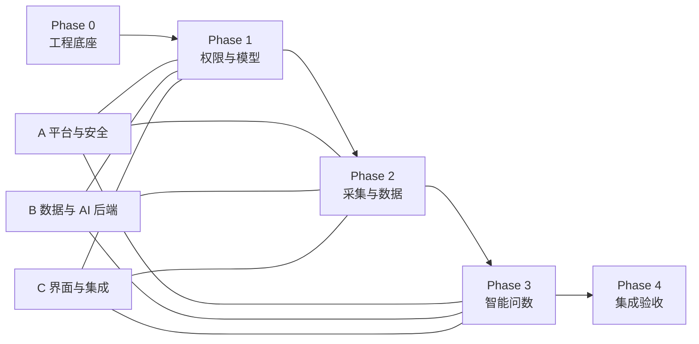

# 三人协作开发计划

## 1. 计划目标

本文将 MVP 拆成可审查、可并行交付的开发阶段。它定义执行顺序、依赖和并行边界，不替代产品需求、数据库或 API 契约。

## 2. 协作方式

项目由三名开发者并行推进，建议按稳定工作流分配责任：

| 工作流 | 主要责任 | 典型改动范围 |
| --- | --- | --- |
| A：平台与安全 | 项目骨架、认证/RBAC、导航、权限、安全基础、审计 | 基础组件、认证/管理端、共享中间件 |
| B：数据与 AI 后端 | 模型引擎、采集、数据仓库、问数编排 | Model、迁移、业务 API、外部调用 |
| C：界面与集成验证 | 管理端/用户端 View、交互、SSE 展示、端到端验收 | 页面、静态资源、集成测试/演示 |

实际人员可互换工作流，但一个工作包在同一阶段应有唯一负责人，减少冲突。

## 3. 开发共识

- 每个工作包使用独立工作分支，如 `feat/auth-rbac`、`feat/model-engine`、`feat/qa-ui`。
- 提交使用 Conventional Commits；每个 PR 或待评审分支聚焦单一工作包。
- 修改共享契约、公共基座或迁移序列前，应先同步另外两位开发者。
- 任何合并均需项目负责人 Code Review 通过；高依赖工作包先合并，依赖方再基于更新后的主分支继续集成。
- Phase 完成条件是其验收门槛通过并完成评审合并，不是各自代码写完。

## 4. Phase 0：工程底座与技术定案

**目标**：消除阻塞并形成三人可并行工作的正式工程基础。

| 工作流 | 可并行工作包 | 依赖/产出 |
| --- | --- | --- |
| A | 落实 Git 评审流程、`uv` 工程规范、Python MVC 工程骨架、配置加载、基础认证中间件接口 | 产出可启动应用和统一目录规范 |
| B | 选择数据库/迁移工具，按 `schema.md` 建立首批迁移和测试数据机制 | 依赖框架初始化约定，可同步设计后落码 |
| C | 建立基础 View 布局、前端请求/SSE 客户端约定、基础页面路由壳 | 依赖 Controller 响应约定 |

需要共同确认的决策：

- Python 包与项目环境使用 `uv`；继续确认 Python Web 框架、ORM/迁移工具、首版数据库与测试框架。
- 页面渲染/前端交互方案。
- 内容检索的 MVP 方案。
- 普通用户由管理员创建还是支持自助注册。

**完成门槛**

- Git 已初始化，主分支和 Code Review 流程可执行；`uv sync` 与 `uv lock --check` 可作为依赖环境验证命令执行。
- 应用可启动，配置不提交秘密，数据库迁移可运行。
- 共享技术选择已写入 `docs/context/decisions.md`，影响的契约已更新。

## 5. Phase 1：管理底座与模型能力

**目标**：建立后续采集和问数必须依赖的权限与模型调用基础。

| 工作流 | 可并行工作包 | 核心验收 |
| --- | --- | --- |
| A | 登录/退出/会话、用户与角色管理、权限校验、动态功能导航、审计基础 | 权限接口和导航过滤可验证 |
| B | 模型配置、秘密加密与掩码、连接测试、默认模型、调用日志 | 可完成脱敏的普通/SSE 模型测试 |
| C | 登录页、后台框架、用户/角色/导航管理页面、模型配置与测试页面 | 页面可调用 Phase 1 API 并展示权限和流式结果 |

并行边界：

- A 负责认证/权限公共接口，B 与 C 不自建绕过授权的身份逻辑。
- B 负责模型 API 与数据实现，C 只通过契约使用脱敏返回值。

**完成门槛**

- MVP 旅程 A 与 B 可演示。
- 权限、CSRF、密钥脱敏和审计关键场景测试通过。

## 6. Phase 2：瞭望采集与数据沉淀

**目标**：从安全来源采集并形成可治理的数据内容。

| 工作流 | 可并行工作包 | 核心验收 |
| --- | --- | --- |
| A | SSRF 校验组件、采集安全策略接入、采集管理权限和审计检查 | 非法目标与越权请求被拒绝 |
| B | 数据源/规则 API、手动采集任务执行、内容标准化、去重追踪、治理状态 | 一次采集可产出可追溯知识内容 |
| C | 数据源与规则配置页、任务状态页、数据仓库查看/治理页面 | 管理员可完成配置、运行、查看和治理流程 |

并行边界：

- 数据源与内容 schema/API 在 Phase 开始前冻结；需要变化时先更新契约并通知全员。
- 安全校验不得由界面或调用约定替代，必须在 B 的执行路径调用 A 的服务端控制。

**完成门槛**

- MVP 旅程 C 可演示。
- SSRF 防护、去重、任务部分失败和治理状态测试通过。

## 7. Phase 3：智能问数闭环

**目标**：用户基于已治理内容获得有引用依据的流式回答。

| 工作流 | 可并行工作包 | 核心验收 |
| --- | --- | --- |
| A | 问数授权、会话数据范围、问数操作必要审计/安全检查 | 用户不可读取他人会话或越权问数 |
| B | 内容检索、问数会话/消息/引用持久化、模型编排、SSE 回答 API | 回答与引用保存完整，失败状态可诊断 |
| C | 用户问数界面、流式回答呈现、引用详情与历史会话交互 | 用户可完成提问并回看引用 |

并行边界：

- B 只从 `available` 内容检索依据，C 不允许向请求中强行指定依据。
- 模型输入安全处理由 B 实现，A 负责安全检查与评审关注点，C 负责正确呈现结果。

**完成门槛**

- MVP 旅程 D 可演示。
- 权限隔离、无依据问题、模型错误和流中断场景已验证。

## 8. Phase 4：MVP 集成验收与交付

**目标**：跨模块联调、修复、安全收口并准备由项目负责人验收合并。

| 工作流 | 可并行工作包 | 核心验收 |
| --- | --- | --- |
| A | 权限矩阵、安全检查、审计完整性检查、发布配置检查 | 高风险边界通过验收 |
| B | 数据迁移/初始化验证、外部依赖失败策略、后端集成修复 | 数据链路和 API 稳定 |
| C | MVP 演示脚本执行、端到端验证、界面问题修复、评审材料汇总 | 四条用户旅程完整展示 |

**完成门槛**

- `docs/product/mvp.md` 全部质量门槛通过。
- `docs/context/current-status.md` 更新为实际验收结果。
- 所有待合并变更已提交工作分支，验证结果齐全，等待或完成项目负责人 Code Review。

## 9. 依赖与并行总览

## 10. 计划维护规则

- 每个 Phase 开始前确认负责人、分支名称、接口/数据契约是否冻结及本阶段验收项。
- 工作包合并或阻塞后及时更新 `docs/context/current-status.md` 和 `docs/context/issues.md`。
- 范围、顺序或关键依赖改变时，更新本计划并在 `docs/context/decisions.md` 记录原因。
