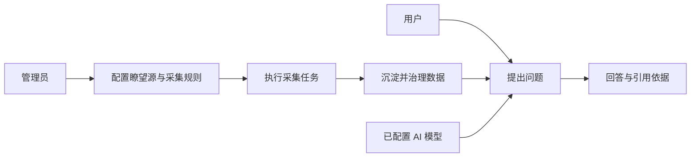

# 产品愿景

## 一句话目标

建设一个能够持续采集可信信息、沉淀可治理数据，并通过 AI 为用户提供有依据回答的智能瞭望与智能问数系统。

## 用户价值

- 管理员可以配置数据来源和采集规则，掌握系统收集了什么信息。
- 管理员可以管理 AI 模型能力，控制系统用什么模型处理问题。
- 用户可以针对已沉淀的数据提问，而不是只获得脱离数据背景的通用回答。
- 系统能够展示回答所依据的内容，便于核验与后续追踪。

## 首版闭环

## 成功标准

- 管理员能够完成系统配置、采集和数据管理的日常操作。
- 用户能够围绕系统数据完成一次可追溯的智能问答。
- 身份、权限、密钥和采集边界具备基础安全控制。
- 文档和实现能够支持 AI 编程工具持续迭代，而不依赖对原型代码的猜测。

## 非首版目标

即时通讯、数字员工编排、舆情大屏、语音或手势增强、复杂自动化和多数据库部署均不属于首版交付承诺。

